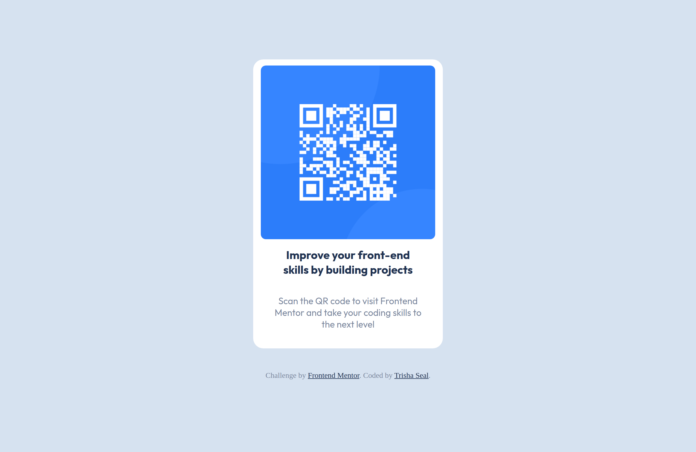
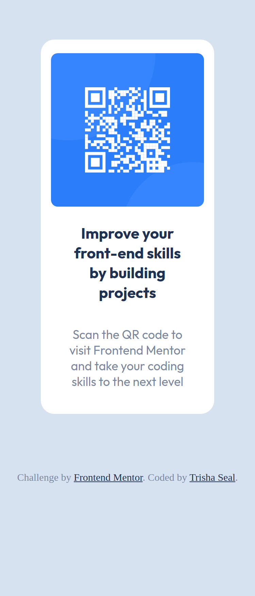

# Frontend Mentor - QR code component solution

This is a solution to the [QR code component challenge on Frontend Mentor](https://www.frontendmentor.io/challenges/qr-code-component-iux_sIO_H). 

## Table of contents

- [Overview](#overview)
  - [Screenshot](#screenshot)
  - [Links](#links)
- [My process](#my-process)
  - [Built with](#built-with)
  - [What I learned](#what-i-learned)
  - [Continued development](#continued-development)
  - [Useful resources](#useful-resources)
- [Author](#author)
- [Acknowledgments](#acknowledgments)

## Overview

### Screenshot

Desktop View:

Mobile View:

### Links

- Solution URL: (https://github.com/EmberTSeal/QRCode)
- Live Site URL: (https://embertseal.github.io/QRCode)

## My process

### Built with

- Semantic HTML5 markup
- Flexbox
- Mobile-first workflow

### What I learned

This is the first project I did completely on my own.

- Implemented max width-height constraints
- Got a clear understanding of the Box Model
- Implemented Flexbox and understood its usage
- Learnt to build responsive pages using Media Queries

### Continued development

As this is my first project, many of my concepts were cleared but further practice is needed to gain more expertise. And so, a few of my next projects will be based on CSS Flexbox. Further, media queries need to explored more to build better pages.

### Useful resources

- [The Odin Project: The Box Model](https://www.theodinproject.com/lessons/foundations-the-box-model) - This article helped me understand the concept of box model very clearly. Highly recommended to anyone who needs help with the box model!
- [The Odin Project: Introduction to Flexbox](https://www.theodinproject.com/lessons/foundations-introduction-to-flexbox) - Amazing article, also by TOP that helped me understand Flexbox.

## Author

- LinkedIn - [Trisha Seal](https://www.linkedin.com/in/trisha-seal-617a89244/)
- Frontend Mentor - [@EmberTSeal](https://www.frontendmentor.io/profile/EmberTSeal)

